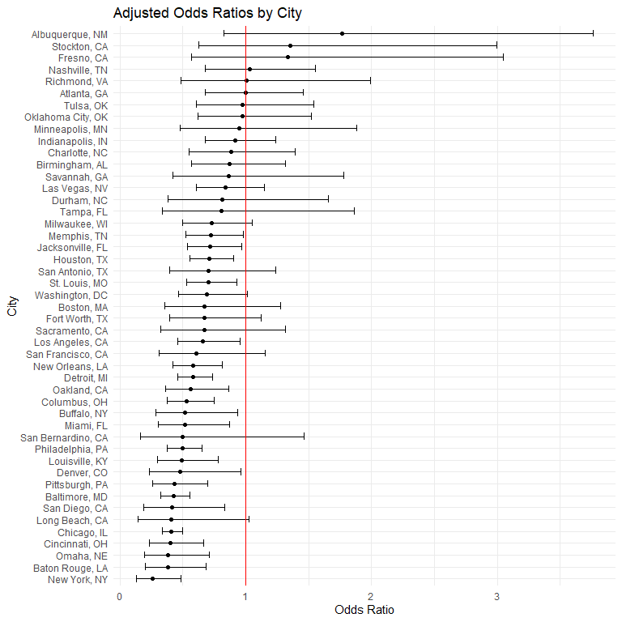
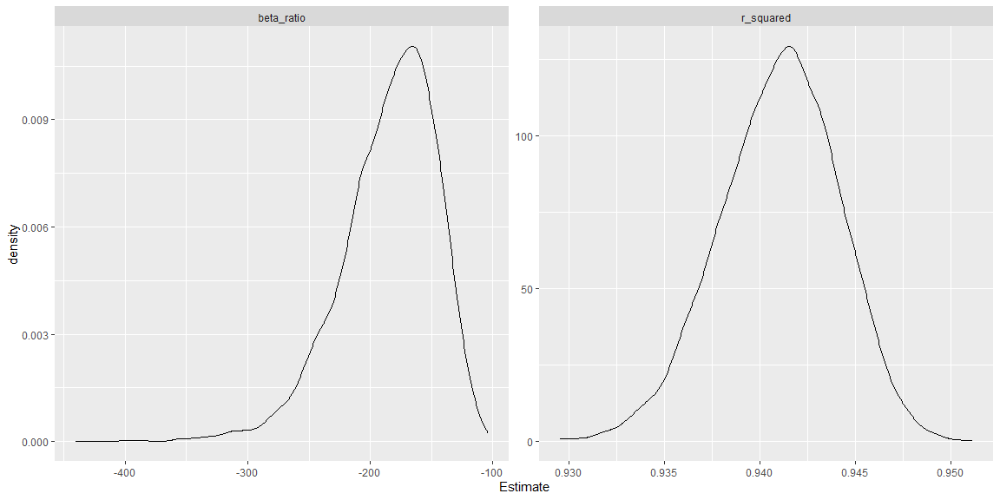
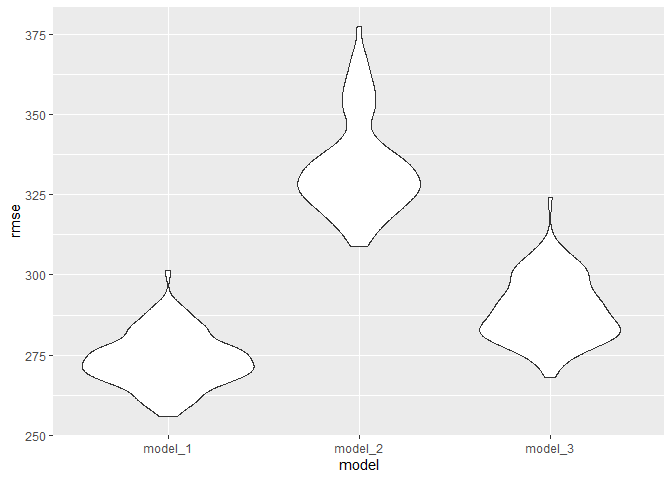

P8105 Data Science I - Homework 6
================
Heng Hu (hh2648)
2025-11-26

``` r
# Setup
library(tidyverse)
library(glmnet)
```

    ## Warning: package 'glmnet' was built under R version 4.5.2

``` r
library(modelr)
set.seed(2648)
```

## Problem 1

``` r
# Read and tidy the data
homicides = read_csv(file = "./data/homicide-data.csv") |> 
   mutate(state = toupper(state),
          city_state = str_c(city, ", ", state),
          reported_date = case_match(reported_date,
                                     201511018 ~ 20151018,
                                     201511105 ~ 20151105,
                                     .default = reported_date),
          reported_date = ymd(reported_date),
          victim_race = as.factor(victim_race),
          victim_age = as.numeric(victim_age),
          victim_sex = as.factor(victim_sex),
          disposition = as.factor(disposition),
          resolved = ifelse(disposition %in% c("Open/No arrest", "Closed without arrest"), FALSE, TRUE)) |> 
  filter(!city_state %in% c("Dallas, TX", " Phoenix, AZ", "Kansas City, MO", "Tulsa, AL"),
         victim_race %in% c("White", "Black"))

# Use the glm function to fit a logistic regression in Baltimore
baltimore_glm = homicides |> 
  filter(city_state == "Baltimore, MD") |> 
  glm(resolved ~ victim_age + victim_race + victim_sex, data = _, family = binomial())

baltimore_glm |> 
  broom::tidy(exponentiate = TRUE, conf.int = TRUE) |> 
  select(term, OR = estimate, conf.low, conf.high) |> 
  filter(term == "victim_sexMale") |> 
  knitr::kable()
```

| term           |        OR |  conf.low | conf.high |
|:---------------|----------:|----------:|----------:|
| victim_sexMale | 0.4255117 | 0.3241908 | 0.5575508 |

``` r
# Apply to all the cities
all_est = homicides |> 
  nest(.by = city_state) |> 
  mutate(model = map(data, \(df) glm(resolved ~ victim_age + victim_race + victim_sex, data = df, family = binomial())),
         result = map(model, broom::tidy, exponentiate = TRUE, conf.int = TRUE)) |>
  unnest(cols = result) |> 
  filter(term == "victim_sexMale") |> 
  select(city_state, term, OR = estimate, ci_lower = conf.low, ci_upper = conf.high)

# Make a plot
all_est |> 
  ggplot(aes(x = OR, y = fct_reorder(city_state, OR))) +
  geom_point() +
  geom_errorbar(aes(xmin = ci_lower, xmax = ci_upper), width = 0.6) +
  geom_vline(xintercept = 1, color = "red") +
  labs(title = "Adjusted Odds Ratios by City",
       x = "Odds Ratio",
       y = "City") +
  theme_minimal()
```

<!-- -->

The plot indicates

## Problem 2

``` r
# Read and tidy the data
library(p8105.datasets)
data("weather_df")

# Apply boostrap to calculate r squared and beta ratio
weather = weather_df |> 
  modelr::bootstrap(n = 5000) |> 
  mutate(model = map(strap, \(df) lm(tmax ~ tmin + prcp, data = df)),
         result_1 = map(model, broom::glance),
         result_2 = map(model, broom::tidy)) |>
  unnest(cols = c(result_1, result_2), names_sep = "_") |> 
  select(.id, r_squared = result_1_adj.r.squared, covar = result_2_term, est = result_2_estimate) |> 
  filter(covar != "(Intercept)") |> 
  pivot_wider(names_from = covar, values_from = est) |> 
  mutate(beta_ratio = tmin / prcp) |> 
  select(-tmin, -prcp) |> 
  pivot_longer(cols = c(r_squared, beta_ratio), 
               names_to = "term", values_to = "est")

# Make a plot to see the distribution of the two quantities
weather |> 
  ggplot(aes(x = est)) +
  geom_density() +
  facet_wrap(~ term, scales = "free")
```

<!-- -->

``` r
# Get 95% CI for the two quantities
weather |> 
  group_by(term) |> 
  summarise(ci_lower = quantile(est, 0.025),
            ci_upper = quantile(est, 0.975)) |> 
  mutate(across(c(ci_lower, ci_upper), ~ formatC(signif(.x, 4), width = 4))) |>
  knitr::kable(col.names = c("Term", "95% CI Lower", "95% CI Upper"))
```

| Term       | 95% CI Lower | 95% CI Upper |
|:-----------|:-------------|:-------------|
| beta_ratio | -274.3       | -125.3       |
| r_squared  | 0.9345       | 0.9467       |

The plot indicates

## Problem 3

``` r
# Read and tidy the data
birth = read_csv(file = "./data/birthweight.csv") |> 
  mutate(babysex = factor(babysex, levels = 1:2, labels = c("male", "female")),
         frace = factor(frace, levels = c(1:4, 8:9),
                        labels = c("White", "Black", "Asian", "Puerto Rican", "Other", "Unknown")),
         mrace = factor(mrace, levels = c(1:4, 8),
                        labels = c("White", "Black", "Asian", "Puerto Rican", "Other")),
         malform = factor(malform, levels = 0:1, labels = c("absent", "present")),
         fincome = fincome * 100
         ) |> 
  rename(b_sex = babysex, b_head = bhead, b_len = blength, b_wt = bwt, m_del_wt = delwt,
         income_mon = fincome, f_race = frace, ga_wks = gaweeks, m_height = mheight, 
         m_age = momage, m_race = mrace, pre_lbw = pnumlbw, pre_sga = pnumsga, 
         pp_bmi = ppbmi, pp_wt = ppwt, m_cigs_day = smoken, m_wt_gain = wtgain)
```

    ## Rows: 4342 Columns: 20
    ## ── Column specification ────────────────────────────────────────────────────────
    ## Delimiter: ","
    ## dbl (20): babysex, bhead, blength, bwt, delwt, fincome, frace, gaweeks, malf...
    ## 
    ## ℹ Use `spec()` to retrieve the full column specification for this data.
    ## ℹ Specify the column types or set `show_col_types = FALSE` to quiet this message.

``` r
# Check missing value
colSums(is.na(birth))
```

    ##      b_sex     b_head      b_len       b_wt   m_del_wt income_mon     f_race 
    ##          0          0          0          0          0          0          0 
    ##     ga_wks    malform   menarche   m_height      m_age     m_race     parity 
    ##          0          0          0          0          0          0          0 
    ##    pre_lbw    pre_sga     pp_bmi      pp_wt m_cigs_day  m_wt_gain 
    ##          0          0          0          0          0          0

Thus, there are no missing values in the `birth` dataset.

Regarding birthweight, I believe that factors related to the newborn
itself, the parents, and economic conditions may all influence
birthweight. I will consider the following variables as predictors and
use LASSO to finalize the model.

The predictors of interest are `b_sex`, `b_head`, `b_len`, `malform`,
`ga_wks`, `f_race`, `m_height`, `m_age`, `m_race`, `pp_bmi`,
`m_cigs_day`, `m_wt_gain`, and `income_mon`.

``` r
# Prepare the data
x = model.matrix(b_wt ~ b_sex + b_head + b_len + malform + ga_wks + f_race + m_height + 
                        m_age + m_race + pp_bmi + m_cigs_day + m_wt_gain + income_mon,
                 data = birth)[, -1]

# Using cross validation to fit LASSO
lasso_cv = cv.glmnet(x, birth$b_wt)

# Get the predictors from the model with the optimal lambda
coef_lasso = coef(lasso_cv, s = "lambda.min")
rownames(coef_lasso)[coef_lasso[,1] != 0]
```

    ##  [1] "(Intercept)"        "b_sexfemale"        "b_head"            
    ##  [4] "b_len"              "ga_wks"             "f_racePuerto Rican"
    ##  [7] "m_height"           "m_age"              "m_raceBlack"       
    ## [10] "m_raceAsian"        "m_racePuerto Rican" "pp_bmi"            
    ## [13] "m_cigs_day"         "m_wt_gain"          "income_mon"

After applying LASSO, we will use the predictors below to fit the model:

`b_sex`, `b_head`, `b_len`, `ga_wks`, `f_race`, `m_height`, `m_age`,
`m_race`, `pp_bmi`, `m_cigs_day`, `m_wt_gain`, and `income_mon`

``` r
# Make a plot of model residuals against fitted values
model_1 = lm(b_wt ~ b_sex + b_head + b_len + ga_wks + f_race + m_height + m_age +
                    m_race + pp_bmi + m_cigs_day + m_wt_gain + income_mon,
             data = birth)

birth |>
  add_predictions(model_1) |> 
  add_residuals(model_1) |> 
  ggplot(aes(x = pred, y = resid)) +
  geom_point(alpha = 0.2)
```

<!-- -->

In our model, most residuals are clustered around zero, indicating a
generally good fit, although a few outliers are present.

``` r
# Cross validation and compare our model with another 2 models
cv_df = crossv_mc(birth, 100) |> 
  mutate(model_1 = map(train, \(df) lm(b_wt ~ b_sex + b_head + b_len + ga_wks + f_race + m_height + m_age +
                                              m_race + pp_bmi + m_cigs_day + m_wt_gain + income_mon,
                                       data = df)),
         model_2 = map(train, \(df) lm(b_wt ~ b_len + ga_wks, data = df)),
         model_3 = map(train, \(df) lm(b_wt ~ b_head * b_len * b_sex, data = df))) |> 
  mutate(rmse_model_1 = map2_dbl(model_1, test, \(mod, df) rmse(model = mod, data = df)),
         rmse_model_2 = map2_dbl(model_2, test, \(mod, df) rmse(model = mod, data = df)),
         rmse_model_3 = map2_dbl(model_3, test, \(mod, df) rmse(model = mod, data = df)))

# Make a plot to compare RMSE values
cv_df |> 
  select(starts_with("rmse")) |> 
  pivot_longer(
    everything(),
    names_to = "model", 
    values_to = "rmse",
    names_prefix = "rmse_") |> 
  mutate(model = fct_inorder(model)) |> 
  ggplot(aes(x = model, y = rmse)) + geom_violin()
```

<!-- -->
